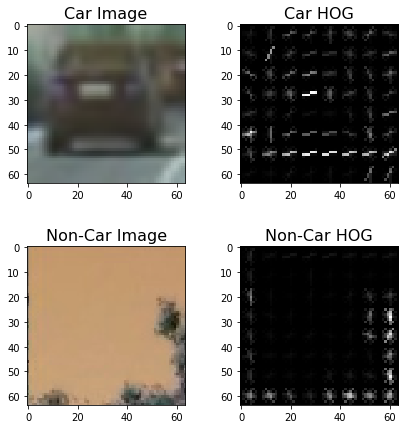
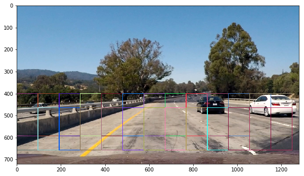

# Vehicle Detection Write-up

## Histogram of Oriented Gradients (HOG)

1. Explain how (and identify where in your code) you extracted HOG features from the training images.

To start, I loaded a parts of my dataset at random displaying both vehicle images and non vehicle images.

Moving on from there, I began extracting features. The function used to do this is `get_hog_features` This can be found in `Visualize HOG on the example image`. My example image shows a randomly picked car image and a non-vehicle image, depicting it's HOG to the right.

The next step in my feature extraction process was to actually use the `extract_features` function, which takes in images and HOG parameters to produce an array (flattened) of HOG features for each image read in.

Next, in the section titled "Extract Features for Input Datasets and Combine, Define Labels Vector, Shuffle and Split," I define parameters for HOG feature extraction and extract features for the entire dataset. These feature sets are combined and a label vector is defined (1 for cars, 0 for non-cars). The features and labels are then shuffled and split into training and test sets in preparation to be fed to a linear support vector machine (SVM) classifier. The table below documents the 10 different parameter combinations that I explored. **Inspired by Jeremey Shannon's well written blog post on this subject**

| Configuration Label | Colorspace | Orientations | Pixels Per Cell | Cells Per Block | HOG Channel | Extract Time |
| :-----------------: | :--------: | :----------: | :-------------: | :-------------: | :---------: | ------------:|
| 1                   | YUV        | 11           | 16              | 2               | ALL         | 42.82        |
| 2                   | HSV        | 9            | 8               | 2               | 1           | 23.6        |
| 3                   | HSV        | 9            | 8               | 2               | 2           | 22.99        |
| 4                   | LUV        | 9            | 8               | 2               | 0           | 24.31        |
| 5                   | LUV        | 9            | 8               | 2               | 1           | 24.73        |
| 6                   | LUV        | 12           | 10              | 1               | 2           | 22.11        |
| 7                   | RGB        | 12           | 10              | 1               | 2           | 47.69        |
| 8                   | HLS        | 12           | 10              | 1               | 2           | 20.60        |
| 9                   | YCrCb      | 12           | 10              | 1               | 2           | 20.05        |
| 10                  | LUV        | 12           | 5               | 10               | 2           | 19.66        |

** 2. Explain how you settled on your final choice of HOG parameters.**

I settled on my final choice basically by testing each variation of the inputs(very random) and found out which would be the best/fastest to use. Time was a huge factor for me because of the time crunch of the project and the time I had personally, I really wanted something to work fairly quickly. However, I found that the fastest result(number 10) was not the most accurate...in reality, number 1 showed better accuracy. I'm glad that I chose number one, because I saw how much of a difference it made in the later stages of my project. The below chart shows my selections.

| Configuration (above) | Classifier | Accuracy | Train Time |
| :-------------------: | :--------: | -------: | ---------: |
| 1                     | Linear SVC | 0.88     | 8.68       |
| 2                     | Linear SVC | 0.98     | 0.94       |

** 3. Describe how (and identify where in your code) you trained a classifier using your selected HOG features (and color features if you used them).**

To achieve the most time efficient(project creation time) I used a SVM with the default classifier, mainly because of the lesson examples.Using HOG features, I achieved 98% accuracy. This is found in `Use a Linear SVC`.

** 4.Describe how (and identify where in your code) you implemented a sliding window search. How did you decide what scales to search and how much to overlap windows?**

In the section titled "Detecting Cars" After some frustration with this topic, I did some more research and found an adapted method based on find_cars from the lesson materials. The method combines HOG feature extraction with a sliding window search, but rather than perform feature extraction on each window individually which can be time consuming, the HOG features are extracted for the entire image (or a selected portion of it) and then these full-image features are subsampled according to the size of the window and then fed to the classifier. The method performs the classifier prediction on the HOG features for each window region and returns a list of rectangle objects corresponding to the windows that generated a positive ("car") prediction.

The image below shows the beginning of this pipeline:

There were alot of experiments done here. Again, I found myself playing with the parameters trying to see what was the best. I settled (and found to be the best fit for the time I had) on a higher scale because anything around 1.0 would result in unwanted false positives. This can be seen in the photos to come.

From here, I combined my findings to a heatmap (found in the section "The heat is on"). I also added a filter/threshold to the heatmap to reduce any further false positives(found on the left side in the very first image) and I used `scipy.ndimage.measurements.label()` to collect continuous areas of the heatmap and assigned labels.

The final detection is then seen at the bottom.

** 5.Show some examples of test images to demonstrate how your pipeline is working. What did you do to optimize the performance of your classifier?**

The final product for the project can be found in the image below. This took some time. After playing with some of the color channels (RGB,LUV specifically)I found that YUV worked the best and gave me the best chance for near perfect accuracy. Making slight adjustments to `pixels_per_cell` also helped in achieving the best results while still staying on target with my speed goals.

# Video Implementation

Here's a link to my video. YouTubeVideo(https://youtu.be/HwqvMRJZm-E)

**The moment we've all been waiting for...**

Is where you will find the function that creates the video stream for detecting cars. The detections for the past 15 frames are combined and added to the heat map and the threshold for the heatmap, which is set to `1+len(det.prev_rects)//2`. This value performed better rather than using a single scalar, or a full number of rectangle sets.

# Discussion

1. Briefly discuss any problems / issues you faced in your implementation of this project. Where will your pipeline likely fail? What could you do to make it more robust?

The problems I faced stemmed from choosing the right parameters to use for my SVM. With the understanding I had coming from the lessons, I thought I needed a lower scale in order to really get everything within view that could potentially be a car. I soon found out that this would cause me more headache than anything, so I sought after a new plan. Quickly heading to google, I found information that proved to be incredibly valuable and saved me from countless hours/days pouring over the same feature. Though my pipeline isn't perfect(by that I mean...it still finds things on the other side/on-coming traffic)it performs as can be expected. 

The problem I see with my pipeline is that it is very short sighted. It doesn't really do well to find cars that are far off into the horizon. I believe I could find a happy medium for this, but it may take more time and power(CPU/GPU). 

More research could be done on this, but from what I've seen in the forums/google searches the best way to really ramp up performance would be to have a very high accuracy classifier(SVM or otherwise) coupled with high overlap in the search windows. Add to this ample time to experiment and computing power and you have the perfect storm.
